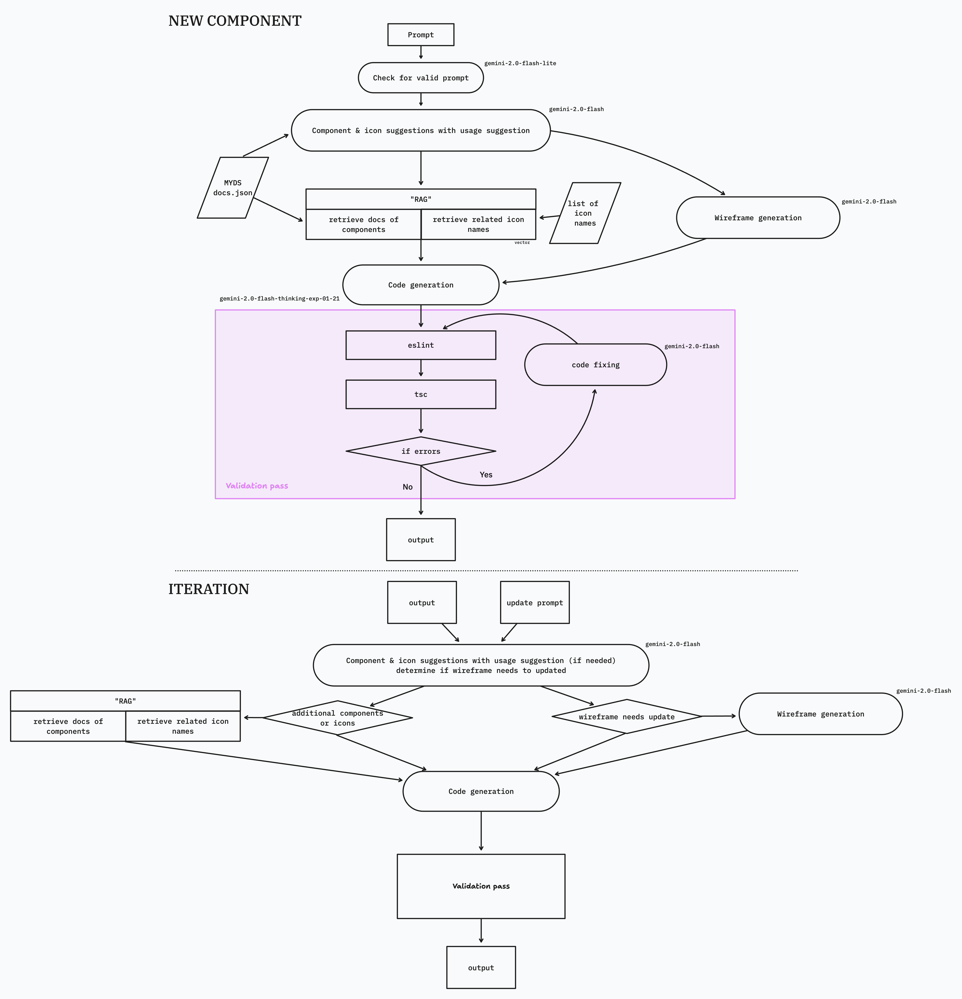

# Setting up the env
1. install packages using [uv](https://github.com/astral-sh/uv)
```sh
uv sync
```

2. create `.env` and add your Gemini API key as in `.env.example`

3. install js modules
```sh
npm i
```

# Setting up data:
1. myds component db
```sh
uv run data/components/extract.py
```

2. icons vector db
```sh
uv run data/icons/build_icon_vector.py
```

# Running in local:
```sh
npm run dev-local
```
API can be accessed http://localhost:3000/api/py/docs

# Examples
1. Python module usage - [example.ipynb](example.ipynb)
2. API usage - [example-api.ipynb](example-api.ipynb)

# Workflow
