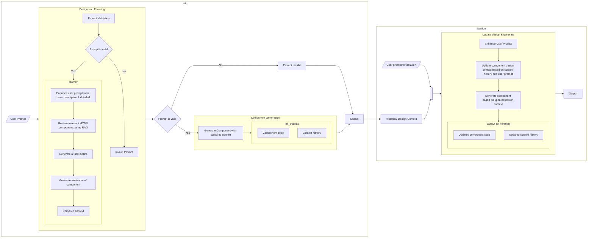

# [WIP] MYDS-Gen
A MYDS component generator

## Setting up the env
1. install packages using [uv](https://github.com/astral-sh/uv)
```sh
uv sync
```

2. install js modules
```sh
npm i
```

## Setting up data:
1. myds component db
```sh
uv run data/components/extract.py
```

2. icons vector db
```sh
uv run data/icons/build_icon_vector.py
```

## Running locally:
```sh
npm run dev-local
```
Access the page on http://localhost:3000/

## Workflow

